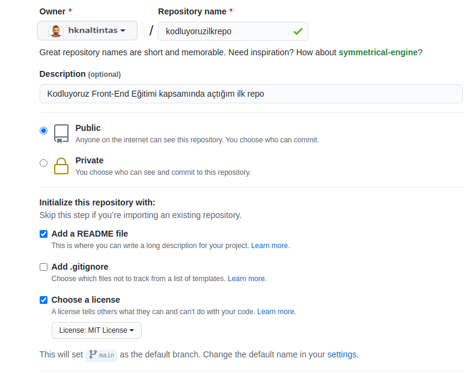

# Kodluyoruz İlk Repo
Bu repo [Kodluyoruz](www.kodluyoruz.org) Front End Eğitiminde oluşturduğumuz ilk repo.İçerisinde bir adet README dosyası, bir adet de index.html barındırıyor.


## Installation

Öncelikle porjeyi clonelayın (Buraya sizin reponuzdan aldığınız link gelecek)

`https://github.com/hknaltintas/kodluyoruzilkrepo.git `

Kodluyoruz Eğitimi kapsamında açtığım ilk repo

## Usage

Projeyi cloneladıktan sonra Visual Studio Code programında açınız.

Linux için:

```
cd kodluyoruzilkrepo
code.
```

## Contributing 

Pull requestler kabul edilir. Büyük değişiklikler için, lütfen önce neyi değiştirmek istediğinizitartışmak için bir konu açınız.

## License 

[MIT](https://choosealicense.com/licenses/mit/)
